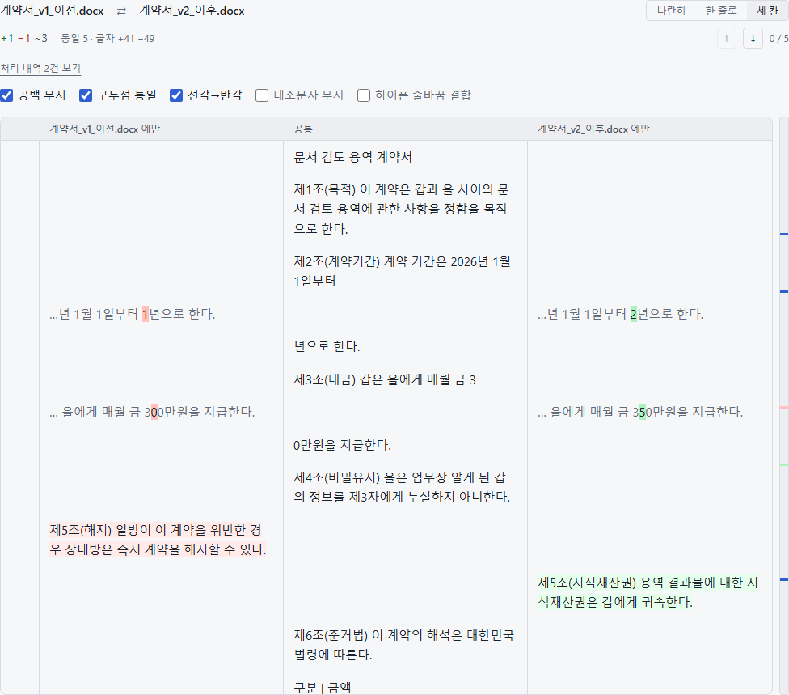
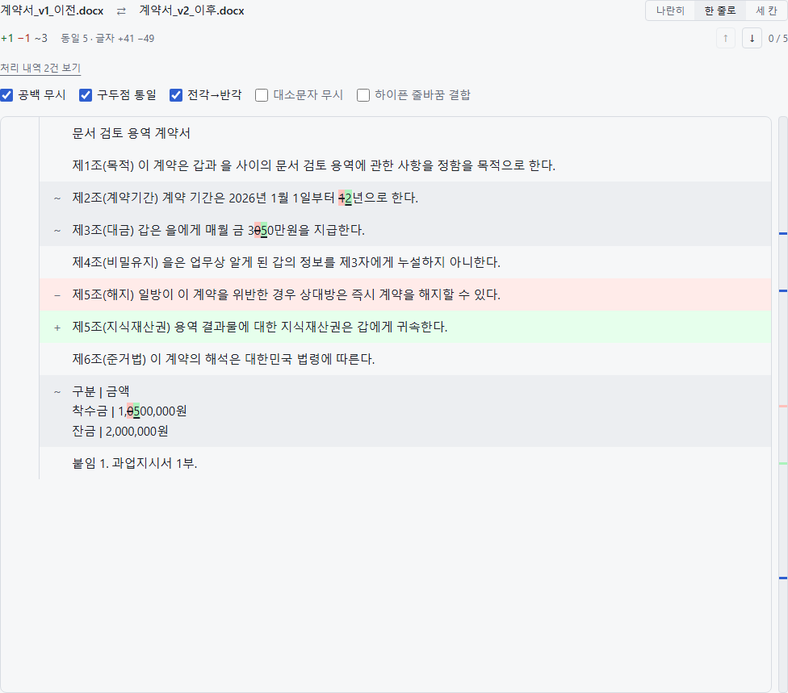
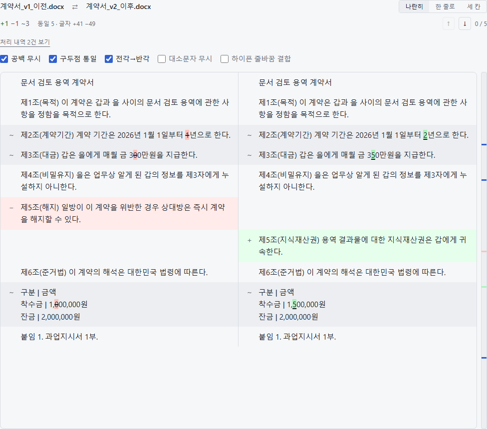

# DocDiff — 문서 두 개를 브라우저에서 비교합니다

파일은 서버로 전송되지 않습니다. 파싱·정규화·diff 가 전부 브라우저 안에서 돕니다(D-01).

배포: https://web-hosting.egghosting.com/docdiff · 진단 화면 `/docdiff/admin`

## 빠른 시작

```bash
npm install
npm run dev        # 개발 서버
npm run verify     # 전송검사 + 테스트 + 빌드 + 번들예산. CI 가 도는 것과 같다
npm run inspect    # src/fixtures/private 의 실문서를 파서에 통과시켜 본다
npm run test:e2e   # Playwright — 시나리오 8개 + 접근성(axe) 13개. dev 서버는 알아서 띄운다
npm run docs:shots # README 의 화면 이미지를 다시 찍는다
```

## 지금 되는 것

| 형식 | 파서 | 방식 |
|---|---|---|
| txt | `txt@1` | BOM → UTF-8 엄격검사 → 후보 디코딩 점수 비교 (CP949·UTF-16 판정) |
| md | `md@1` | 제목·목록·인용·코드펜스·표 블록 문법 |
| docx | `docx@1` | `word/document.xml` 직접 파싱 |
| hwpx | `hwpx@1` | `Contents/sectionN.xml` |
| hwp | `hwp@1` | CFB → raw deflate → 레코드 → PARA_TEXT 제어문자 해석 |
| pdf | `pdf@1` | 트랙 A 구조트리 → 트랙 B 기하 재조립 → 트랙 C 스캔 판정 |

diff 는 3단계다 — 블록 LCS(Myers + 앵커 분할) → 짝짓기(Dice) → 한국어 어절
인라인. "계약서를 → 계약서는" 에서 조사 한 글자만 짚는다.

그 밖의 UI: 변경 요약, 변경점 점프, 미니맵, 동일 구간 접기, 비교 옵션
토글(재파싱 없음), 뷰어 모드, 단축키(s 로 보기 순환), 암호 PDF 비밀번호 입력
(T-040 — 비밀번호도 브라우저 밖으로 나가지 않는다).

## 화면

아래 화면은 모두 같은 문서 두 벌을 비교한 것이다 — 용역 계약서 v1 / v2.
넷이 섞여 있다: **완전히 같은 문단**, **숫자만 다른 문단**(1년→2년, 300→350만원),
**한쪽에만 있는 문단**(v1 제5조 해지 ↔ v2 제5조 지식재산권), **표 안의 금액 변경**.

### 세 칸 — 기본 보기



가운데는 두 문서가 **같은** 부분, 왼쪽은 **이전에만** 있는 것, 오른쪽은 **이후에만**
있는 것이다. 문단 하나가 "공통 → 갈림 → 공통" 으로 펼쳐진다.

- 제2조는 "…2026년 1월 1일부터" 까지가 공통이라 가운데에만 있고, 바뀐 숫자
  `1` ↔ `2` 만 좌우로 갈린 뒤 "년으로 한다." 가 다시 가운데로 돌아온다
- **조각이 한두 자로 짧으면 앞뒤 맥락을 흐린 회색으로 덧붙인다.** "1" 하나만
  떼어 놓으면 무엇이 바뀐 건지 알 수 없다. 회색은 diff 결과가 아니라 읽기
  보조이고, 바뀐 글자에만 색이 들어간다
- 제5조는 서로 다른 조항이라 왼쪽 한 칸 · 오른쪽 한 칸으로 마주 본다
- 좌우 칸에 상대편 글자가 섞이는 일은 없다
- **가운데 열만 세로로 훑으면 두 문서가 합의한 본문이 그대로 읽힌다.**
  그 자리를 직접 고쳐 병합본을 만드는 것이 다음 작업이다(`docs/NEXT.md` P2-0)

조각을 나누는 계산은 `src/components/diff/tripleRows.ts` 의 순수 함수다.
조각마다 안정적인 id 가 있어, 편집 상태를 렌더링과 무관하게 얹을 수 있다.

맥락을 붙일 때 낱말 경계는 `Intl.Segmenter` 가 잡는다(`src/core/segment.ts`).
공백으로 자르면 중국어·일본어·태국어에서 문장 전체가 한 낱말이라 통째로 끌려온다.
같은 이유로 인라인 diff 의 문자 재분해도 코드포인트가 아니라 **자소** 단위다 —
이모지 조합과 결합 문자가 반쪽으로 갈리지 않는다. 조각 칸은 `dir="auto"` 와
`unicode-bidi: isolate` 로 감싸, 아랍어·히브리어 조각을 문맥에서 떼어 놓아도
순서가 뒤집히지 않는다.

### 한 줄로 (Unified)



한 자리에 삭제(취소선)와 추가(밑줄)를 겹쳐 놓는다. 변경이 적을 때 훑기 빠르지만,
제2조를 보면 `1`과 `2`가 겹쳐 "12년" 처럼 읽힌다. **세 칸을 기본으로 둔 이유가 이것이다.**

### 나란히 (Split)



좌우에 원본을 그대로 두고 같은 행끼리 맞춘다. 문단 전체를 통으로 견줄 때 쓴다.

> 이 이미지들은 `npm run docs:shots` 로 다시 찍는다. 표본 계약서까지 코드로
> 만들어(`tests/shots/samples.ts`) 실제 앱에 올리고 캡처하므로, 화면이 바뀌면
> 한 번의 명령으로 갱신된다. 손으로 찍은 스크린샷은 조용히 낡는다.

단위 테스트 185개 + E2E 20개(시나리오 8 + 접근성 12), 초기 로드 72.0KB (예산 200KB).

> **아직 실문서를 통과시켜 본 적이 없다.** 단위 테스트의 입력은 전부 합성
> 데이터다. 무엇이 남았고 왜 그것이 1번인지는 `docs/NEXT.md` 를 본다.

## 진단 화면

`/docdiff/admin` 에서 확인할 수 있는 것.

- 파서별 동작 방식·한계, 동적 import 성공 여부와 소요 시간
- 런타임 확인 (euc-kr·utf-16le 디코더, WebAssembly, Worker, 워커 응답)
- kordoc 설치 여부 (U-01 스파이크)
- **파일 하나를 넣으면** 어떤 파서가 붙었는지, 몇 블록인지, 신뢰도·경고·
  추출 트랙·소요 시간, 앞 10블록 미리보기
- HWP·PDF 표본 측정 도구 (T-004 ~ T-006)

**판단 기준**
- HWP 성공률 < 80% → v1 에서 `.hwp` 제외, `.hwpx` 만 지원
- 제어문자 잔여 > 0 → `hwp/paraText.ts` 의 8 WCHAR 처리 버그
- PDF 트랙 A 적중률이 높을수록 §6.5 기하 재조립 부담이 줄어든다

## 터미널 검수 (`npm run inspect`)

파일을 하나씩 화면에 넣는 대신 폴더째 돌린다. 워커를 거치지 않고
`document.worker.ts` 와 같은 순서로 파서를 직접 부르며, 위 판단 기준을
그대로 코드로 옮겨 파일마다 근거를 찍는다.

```bash
npm run inspect                        # src/fixtures/private 전체
npm run inspect -- 어떤파일.hwp        # 하나만
npm run inspect -- --json snapshots/   # NormalizedDoc 스냅샷 저장 (T-018 의 입력)
```

문서를 어디에 넣고 무엇을 모아야 하는지는 `src/fixtures/README.md` 에 있다
(`private/` 은 `.gitignore` 라 개인 문서를 넣어도 커밋되지 않는다).

## 구조

```
src/
├── core/          DOM·React 의존성 0. Node 에서 그대로 테스트된다
│   ├── types.ts       모든 레이어가 공유하는 계약
│   ├── detect.ts      매직 넘버 우선 형식 감지
│   ├── mode.ts        비교/뷰어 모드 결정 (D-02)
│   ├── normalize.ts   정규화 파이프라인 (NFC 는 항상 적용)
│   ├── xml.ts         DOM 없는 XML 스캐너 (워커에는 DOMParser 가 없다)
│   ├── diff/          Myers + 앵커 분할, 짝짓기, 한국어 인라인
│   └── parsers/       확장자 → 동적 import. pdf/ hwp/ 는 하위 폴더
├── workers/       Comlink 프로토콜 + 클라이언트
├── components/    diff/ viewer/ upload/ common/ (diff/tripleRows.ts = 세 칸 조각 계산)
├── app/           라우터 + 비교 화면 + 관리 화면
├── store/         Zustand
├── fixtures/      검수용 실문서 자리 (private/ 는 커밋되지 않는다)
└── spikes/        측정 도구 (/admin 에서 연다)
```

## 규칙

- **`src/core` 에 DOM 을 들이지 않는다.** 테스트가 브라우저 없이 돌아야 한다.
- **파일 바이트를 네트워크로 보내지 않는다.** `npm run lint:no-upload` 가 강제한다.
- **형식별 파서는 반드시 동적 import.** 정적으로 넣으면 번들 예산 검사가 실패한다.
- **정규화 옵션을 바꿔도 재파싱하지 않는다.** `rawText` 를 들고 있으므로 `renormalize` 만 돈다.
- **워커에서 던지는 에러는 `toJSON()` 으로 바꿔 던진다.** Comlink 가 Error 서브클래스를
  message/name/stack 으로만 넘겨서, 그냥 던지면 `code` 가 사라진다.
- **테스트용 문서는 코드로 만든다.** 저장소에 바이너리 픽스처를 두지 않는다
  (`tests/helpers/makeDocs.ts`, `tests/helpers/encryptedPdf.ts`).
- **`--color-*-strong` 은 배경색이다.** 글자에는 `--color-add-text` / `--color-del-text` 를 쓴다.
  강조색을 글자로 쓰면 대비가 4.5:1 에 못 미친다(axe 가 잡는다).
- **테마 오버라이드는 `@theme` 이 아니라 평범한 `:root` 규칙으로 쓴다.** Tailwind v4 는
  `@theme` 을 전부 하나의 `:root` 로 끌어올려서, 미디어쿼리 안에 두면 미디어쿼리가
  사라지고 값만 덮어쓴다(그래서 한동안 다크 전용이었다).

## 다음

`docs/NEXT.md` 에 남은 작업과 우선순위, 알려진 한계, 운영 메모를 정리해 뒀다.

## 배포 (에그호스팅)

`web-hosting` 서비스에 앱으로 올라간다. 한 서비스에 프로젝트를 여러 개 두고 경로로 가른다.

| 경로 | 앱 |
|---|---|
| `/` | landing (프로젝트 목록) |
| `/docdiff` | 이 프로젝트 |
| `/php` | php-project |

접속: https://web-hosting.egghosting.com/docdiff

배포하면서 부딪힌 제약 셋. 새 프로젝트를 올릴 때도 그대로 적용된다.

- **`base` 는 빌드만 `/docdiff/`, 서빙(dev·preview)은 `/`.** 프록시가 `/docdiff` prefix 를 떼고 앱에 넘긴다.
  - 빌드를 상대경로(`'./'`)로 두면, 끝 슬래시 없는 주소(`/docdiff`)로 들어왔을 때 브라우저가
    `./assets/...` 를 `/assets/...` 로 풀어 **루트에 붙은 다른 앱**으로 새어 나간다.
    제목만 뜨고 본문이 백지가 된다. 이게 실제로 났던 증상이다.
  - 반대로 preview 의 base 까지 `/docdiff/` 로 두면, prefix 가 떼인 요청에 preview 가 다시
    `/docdiff/` 로 리디렉트해 **무한 리디렉트**가 된다.
  - 게다가 nginx 는 라우팅을 막 저장한 직후에는 prefix 를 떼지 않다가 재동기화 뒤에 떼기 시작했다.
    그래서 `vite.config.ts` 의 `tolerate-mount-prefix` 플러그인이 양쪽을 다 받아준다.
- **`preview.allowedHosts` 가 필요하다.** 플랫폼이 이 앱을 `node/vite_static` 으로 감지해
  `vite preview`(포트 4173)로 띄우는데, preview 는 모르는 Host 헤더를 403 으로 막는다.
  증상은 `Blocked request. This host ... is not allowed.`
- **빌드 도구는 `dependencies` 에 둔다.** 배포 서버가 프로덕션 의존성만 설치한 뒤 `npm run build` 를 돌린다.
  `vite`/`typescript`/`tailwindcss` 를 `devDependencies` 에 두면 `tsc: not found` 로 빌드가 실패한다.

`server/static.mjs` 는 `npm start` 용 의존성 0 정적 서버다(현재 플랫폼은 `vite preview` 를 쓰므로
프로덕션에서 돌지는 않는다). `dist/` 만 내려주고 문서 바이트는 서버로 오지 않는다(D-01).

### 배포 절차

배포 통로가 파일 내용을 그대로 실어 보내는 방식이라, 전체 소스(180KB 남짓)를 매번 올리면 비싸다.
바뀐 것만 올린다.

```bash
npm run verify        # 통과 못 하면 배포하지 않는다
npm run deploy:plan   # 무엇이 바뀌었는지
# → 나온 목록만 write_file 로 올린다 (새 폴더는 make_dir 먼저, 지울 건 delete_file)
# → restart_app
npm run deploy:record # 매니페스트 갱신
```

`vite.config.ts` 의 `rebuild-if-stale` 플러그인이 preview 시작 때 dist 가 소스보다 낡았는지 보고
필요하면 다시 빌드한다. 그래서 **재시작 = 지금 소스대로 서빙**이 성립한다.
플랫폼은 `vite preview` 로만 띄우고 소스가 바뀌어도 다시 빌드해 주지 않기 때문에 필요한 장치다.

`deploy/manifest.json` 에 마지막으로 올린 파일들의 해시가 들어 있다. 이 파일을 지우면 전체가
"새 파일"로 잡힌다(첫 배포와 같다).
